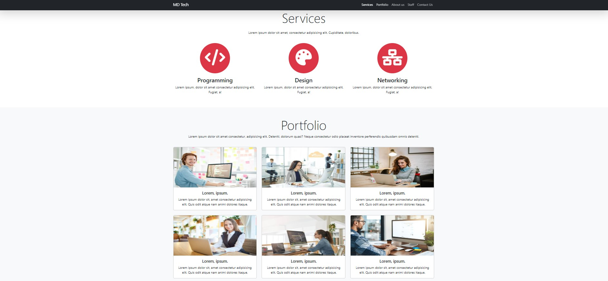
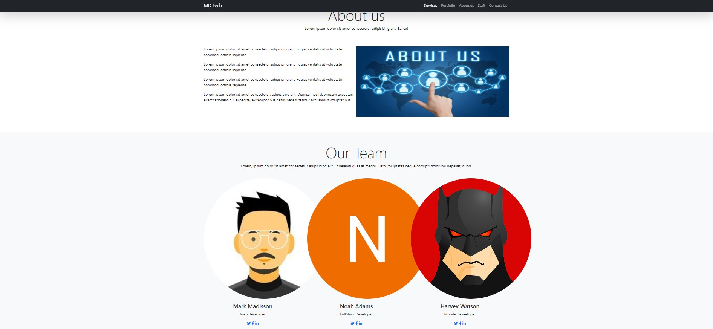

# MD Tech Website

This project contains a website created for MD Tech, a technology firm. The website provides information about the company, its services, portfolio, team, and contact details.
## Screenshot

## Live Demo:
- [Link to live demo](https://team-al-mas.vercel.app/)

## Contents

- [Overview](#overview)
- [Technologies Used](#technologies-used)
- [Usage](#usage)
- [Contributing](#contributing)
- [License](#license)

## Overview

This website is designed to provide potential customers and visitors with information about MD Tech, showcase the services they offer, display their portfolio, introduce their team, and share contact information.

The website includes the following sections:

- **Navbar**: Provides quick access to the homepage, services, portfolio, about us information, team, and contact details.
- **Banner**: Provides a general overview of the services offered by MD Tech and directs visitors to the services.
- **Services**: Includes information about the services offered by MD Tech and short descriptions for each service.
- **Portfolio**: A portfolio gallery showcasing some of the projects MD Tech has undertaken in the past.
- **About Us**: Provides detailed information about MD Tech.
- **Team**: Includes photographs of company employees and team members along with their positions and links to social media.
- **Contact**: A contact form and contact details for visitors to get in touch with the company.

## Technologies Used

This website uses the following technologies:

- **HTML**: To structure the web pages.
- **CSS**: To apply and style the page layouts.
- **Bootstrap**: A library used for rapid and responsive web design.
- **Font Awesome**: Used to easily add icons and visual elements.

## Usage

Using this website is quite simple. You can open the HTML file in a web browser to see the site in action.

## Contributing

This project is open source and contributions are always welcome. You can submit pull requests to add new features, fix bugs, or improve documentation.

## License

This project is licensed under the MIT License. See the [LICENSE](LICENSE) file for more information.

